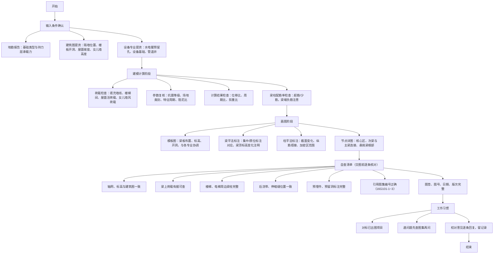

---
tags:
  - 设计
  - 配筋
  - 混凝土
  - 规范
---

# 设计心得

结构设计中的经验总结与规范要点速查。

---

## 初步设计

施工图开始前，先理清这几点，避免后期大改：

- **下层墙柱不能大于上层**——否则上层传到下层的力无处落脚
- **客厅、主卧、次卧不能有次梁**，次梁一般放在卫生间等次要区域
- 轴网可以套用建筑的，但**标注最好自己画**，建筑标注习惯和结构不同
- 出图前检查说明、墙柱定位、梁编号
- 梁最好画在下一层的墙上面，方便施工
- 有地下室时，**首层墙柱要对齐 -1 层的墙柱！**

---

## 板配筋

### 板厚取值

| 板类型 | 最小厚度 | 建议厚度 |
|--------|----------|----------|
| 单向板 | L/30 | 100-120mm |
| 双向板 | L/40 | 100-150mm |
| 悬挑板 | L/12 | 120-150mm |

### 配筋要点

- 底筋常用 φ8@150-200，支座负筋 φ8@100-200
- 大跨度板注意挠度和裂缝验算
- 洞口周边须补强钢筋
- 屋面层板筋要**双层双向拉通**

### 常见问题

!!! tip "TSSD 搜板失败"

    检查梁线是否闭合，先用 **JX** 命令做交线处理。

---

## 梁配筋

悬臂梁需设置箍筋加密（如阳台两边的悬臂梁）。

### 截面尺寸

!!! note "抗规 6.3.1"

    - 截面宽度 ≥ 200mm
    - 高宽比 ≤ 4
    - 净跨与截面高度之比 ≥ 4

### 总体原则

- 底筋直径大的放在第一排
- 配筋率超过 0.2% 时，箍筋直径加大一级
- **支座和跨中配筋不宜超过计算结果的 1.1 倍**（构造配筋时不额外增加面积）
- 标准层钢筋最大直径建议不超过 22mm，框架梁最小 14mm，次梁最小 12mm
- 梁跨度 4m 以内拉通，截面标注不要放在两条梁线之间
- 尽量减少钢筋搭接

### 通长筋与架立筋

!!! info "核心原则 — 抗规 6.3.4"

    **拉通钢筋面积 ≥ 梁两端支座负弯矩钢筋较大值的 1/4**，且不少于 2 根。

    - 一、二级不应少于 2Φ14；三、四级不应少于 2Φ12
    - 框架梁一、二级抗震为 1/4，三级抗震为 1/5（高规 6.3.4）
    - 地震往复作用下，梁端交替出现正负弯矩。若通长筋太少，跨中可能出现无筋区，导致脆性破坏——通长筋起"兜底"作用
    - 做法：面筋用小直径贯通 + 支座大直径附加，贯通筋满足 1/4 下限即可，不足的量用附加短筋补充，避免全长大直径造成浪费

- 纵向构造钢筋截面面积不应小于梁跨中下部纵向受力钢筋计算所需截面面积的 1/4，且不少于 2 根

**通长筋 vs 架立筋：**

|          | 通长筋                       | 架立筋                       |
|----------|------------------------------|------------------------------|
| 用途     | 参与受力，抗震需要             | 构造需要，维持钢筋骨架         |
| 用于     | 框架梁（主梁）                 | 次梁                         |
| 规格     | ≥ Φ12                        | Φ10 或 Φ12                   |
| 表示     | —                            | （NΦ12）中 N 表示根数         |

- 次梁架立筋配箍：梁高 ≤ 600mm → Φ6@200；梁高 > 600mm → Φ8@200
- 次梁无加密区，但支座配筋较大时可局部加密（如 Φ6@150/200）
- 框架梁在满足计算情况下，第二排底筋可不伸入支座
- 梁配筋计算按 **T 型截面**考虑楼板翼缘贡献

### 构造要求

!!! warning "重点检查项"

    - 顶底面通长钢筋直径不小于 12mm

    **受压区和配筋率（抗规 6.3.3）：**

    - 梁端计入受压钢筋的混凝土受压区高度 / 有效高度：一级 ≤ 0.25，二、三级 ≤ 0.35
    - 梁端底面钢筋 / 顶面钢筋：一级 ≥ 0.5，二、三级 ≥ 0.3
    - 梁端纵向受拉钢筋配筋率 ≤ 2.5%

    **箍筋加密区（抗规 6.3.3 表 6.3.3）：**

    - 加密区长度、箍筋最大间距和最小直径按表 6.3.3
    - 配筋率 > 2% 时，箍筋最小直径增大 2mm
    - 箍筋肢距：一级 ≤ 200mm，二三级 ≤ 250mm，四级 ≤ 300mm

    **其他构造：**

    - 梁纵筋最大直径 ≤ 柱边长的 1/20，防止钢筋滑移
    - 悬挑段配筋放大 1.1~1.2 倍，面筋贯通，箍筋全加密
    - 支座两侧尽量选取同直径钢筋，方便贯通
    - 屋面层板筋要双层双向拉通
    - 箍筋加密区间距不宜大于非加密区的 2 倍
    - 配筋率 > 2.0% 时，加密区箍筋提高一个直径等级，非加密区不变
    - 主次梁交接处优先用箍筋，吊筋须按计算配置，不得随意加大

**纵筋最小净距：**

- 梁上部钢筋水平净距 ≥ 30mm 和 1.5d
- 梁下部钢筋水平净距 ≥ 25mm 和 d
- 下部钢筋多于 2 层时，2 层以上中距增大一倍；各层净距 ≥ 25mm 和 d

**其他：**

- 框架梁内贯通中柱的每根纵向钢筋直径 ≤ 1/20 L（L 为矩形边长或圆形直径）
- 通长筋 + 支座附加的模式：小直径贯通 + 大直径支座附加

### 参考图示

---

## 柱配筋

!!! note "抗规 6.3.5 截面尺寸"

    - 四级或 ≤2 层：截面宽/高 ≥ 300mm，圆柱直径 ≥ 350mm
    - 一~三级且 >2 层：截面宽/高 ≥ 400mm，圆柱直径 ≥ 450mm
    - 剪跨比 > 2
    - 截面长边与短边比 ≤ 3
    - 柱轴压比不宜超过表 6.3.6 的规定

### 纵筋配置

!!! note "抗规 6.3.7 / 6.3.8"

    **最小总配筋率（6.3.7-1）：** 按表 6.3.7-1 采用，同时每一侧配筋率 ≥ 0.2%

    **构造规定（6.3.8）：**

    - 纵筋宜对称配置
    - 截面边长 > 400mm 时，纵筋间距 ≤ 200mm
    - 总配筋率 ≤ 5%
    - 剪跨比 ≤ 2 的一级框架柱，每侧纵筋配筋率 ≤ 1.2%
    - 边柱、角柱小偏心受拉时，纵筋总面积 **增加 25%**
    - 绑扎接头避开柱端加密区

### 箍筋配置

!!! note "抗规 6.3.7-2 / 6.3.9"

    **加密区箍筋间距和直径（6.3.7-2）：** 按表 6.3.7-2 采用，特殊情况：

    - 一级柱箍筋 >Φ12 且肢距 ≤150mm → 最大间距允许 150mm（底层柱下端除外）
    - 二级柱箍筋 ≥Φ10 且肢距 ≤200mm → 最大间距允许 150mm
    - 三级柱截面 ≤400mm → 箍筋最小直径允许 6mm
    - 四级柱剪跨比 ≤2 → 箍筋直径 ≥ 8mm
    - 框支柱和剪跨比 ≤2 的柱，箍筋间距 ≤ 100mm

    **加密区范围（6.3.9，取大值）：**

    - 柱端：截面高度、柱净高 1/6、500mm 三者最大值
    - 底层柱下端 ≥ 柱净高 1/3
    - 刚性地面上下各 500mm
    - 剪跨比 ≤2、填充墙形成短柱、框支柱、一二级角柱 → **全高加密**

    **箍筋肢距：** 一级 ≤200mm，二三级 ≤250mm，四级 ≤300mm
    至少每隔一根纵筋宜在两个方向有箍筋或拉筋约束

---

## 基础设计

### 底板（筏板）

- 筏板最小配筋率 **0.15%**，厚度由抗冲切控制，最小 300mm
- 通长筋 + 附加筋形式；底筋伸入基础满足锚固长度即可
- 抗水板厚 250~400mm（计算确定），底标高在地下水位以上时最小可取 150~200mm
- 两层地库底板建议 450 厚，三层地库建议 550 厚

### 外墙

- 荷载：水土侧压力，静止土压力系数近似 0.50；有支护时 ×0.66 折减
- 地面荷载取 **5kN/m²**；土容重 18kN/m³，水下 11kN/m³
- 计算：一般按上部铰支、下部嵌固；与剪力墙交接处考虑支撑作用
- 竖向筋：小直径通长（0.20% 配筋率）+ 1/3 层高附加；通长筋最小 Φ10
- 水平筋：满足构造 0.20% 配筋率

### 桩基础

- 摩擦桩 → 细长桩；端承桩 → 扩底桩；桩身强度控制 → 大直径或提高混凝土等级
- 桩身与承台混凝土强度等级相差 ≤ 两级

### 抗渗

按《地下工程防水技术规范》第 4.1.4 条：

| 地下水位深度 H | 抗渗等级 |
|:--------------:|:--------:|
| H < 10m        | P8       |
| 10 ≤ H < 20m   | P8       |
| 20 ≤ H < 30m   | P10      |

### 参考图示

---

## 荷载取值

!!! tip "常用荷载速查"

    | 工况 | 取值 |
    |------|------|
    | 外墙线荷载 | 2.6 ×（楼层高度 - 梁高） |
    | 恒载（常规楼面） | 1.5 kN/m² = 0.05×20（水泥容重）+ 0.5 |
    | 厕所（降板 0.6m） | 6.5 kN/m² = 0.6×10 + 0.5 |

---

## 工作流程

---

## 规范速查

| 规范 | 关键条款 | 要点 |
|------|----------|------|
| 《抗规》GB50011 6.3.1 | 梁截面 | 宽 ≥200，高宽比 ≤4，净跨/截面高度 ≥4 |
| 《抗规》GB50011 6.3.3 | 梁箍筋加密 | 加密区长度/间距/直径按表 6.3.3，配筋率>2% 时直径 +2mm |
| 《抗规》GB50011 6.3.4 | 梁配筋 | 通长筋 ≥1/4 支座较大值，配筋率 ≤2.5%，底/顶比一≥0.5 二三≥0.3 |
| 《抗规》GB50011 6.3.5 | 柱截面 | 四级 ≥300，一~三级 ≥400；剪跨比>2；轴压比按表 6.3.6 |
| 《抗规》GB50011 6.3.7 | 柱配筋 | 最小总配筋率表 6.3.7-1，加密区表 6.3.7-2 |
| 《抗规》GB50011 6.3.8 | 柱纵筋 | 对称配置，总配筋率≤5%，边角柱受拉 +25% |
| 《抗规》GB50011 6.3.9 | 柱箍筋 | 加密区取大值（截面/1/6柱高/500），短柱/框支柱/角柱全高加密 |
| 《高规》6.3.4 | 梁通长筋 | 一二级 1/4，三级 1/5 |
| 《地下工程防水技术规范》4.1.4 | 抗渗等级 | H<10→P8, 10~20→P8, 20~30→P10 |
